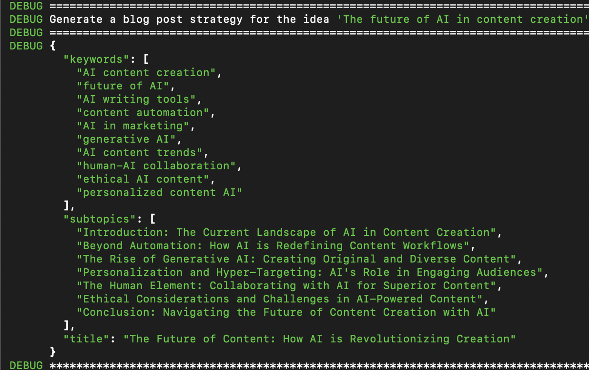
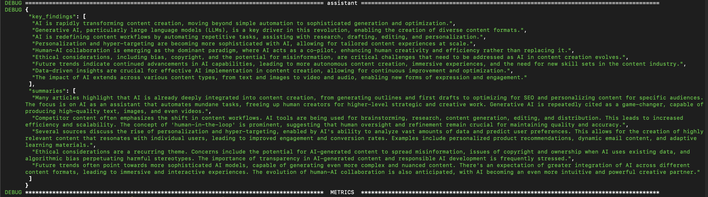
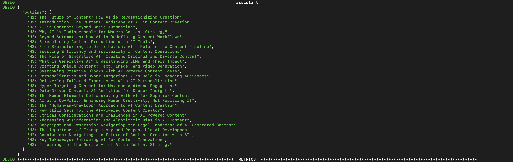
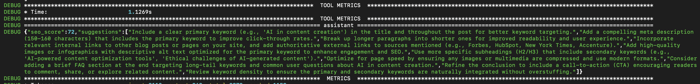
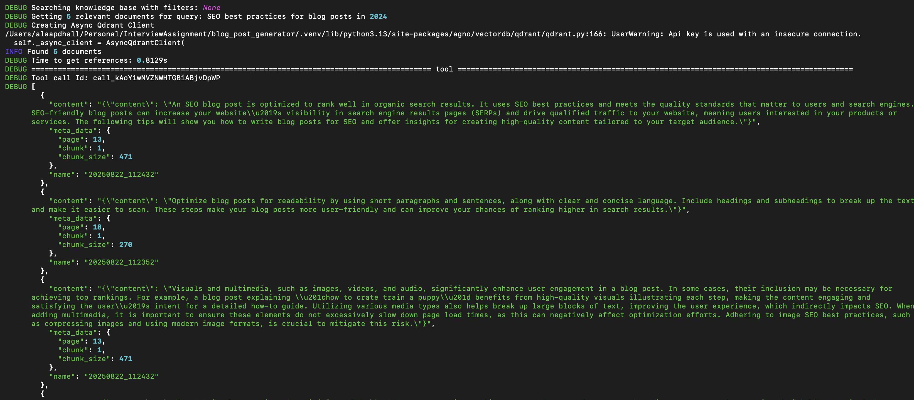
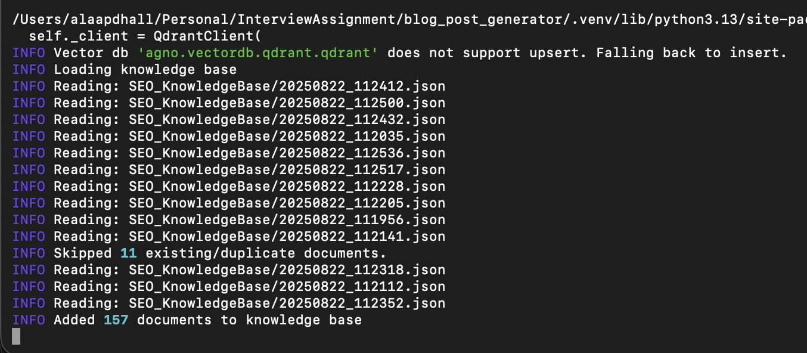
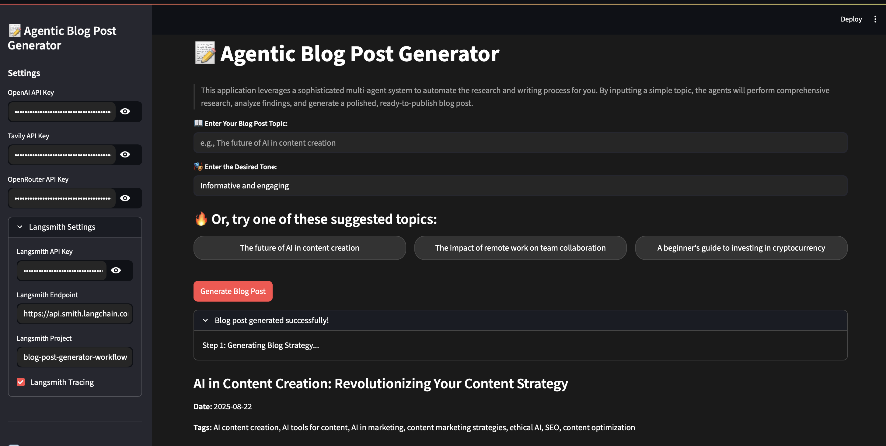
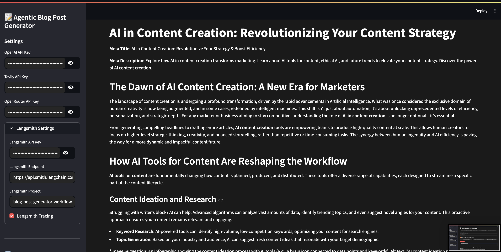

# Multi-Agent Blog Post Generation Workflow

Multi-agent system that generates SEO-optimized blog posts using **Agentic RAG** with Qdrant VectorDB, advanced **tool calling** for research, **team-level** orchestration, and **Langsmith** monitoring. This workflow combines competitive analysis and keyword discovery for professional blog post generation in Agno-AGI.
 
## Table of Contents

- [Application Flow](#application-flow)
- [Architectural Choices and Rationale](#architectural-choices-and-rationale)
- [Why Agno?](#why-agno)
- [The Team of AI Agents](#the-team-of-ai-agents)
- [Agent Collaboration and Orchestration](#agent-collaboration-and-orchestration)
- [Tools Integration](#tools-integration)
- [Agentic RAG Integration](#agentic-rag-integration)
- [Observability & Configurability](#observability--configurability)
- [What Makes This Solution Competitive?](#what-makes-this-solution-competitive)
- [How to Install and Use](#how-to-install-and-use)
- [Streamlit UI](#streamlit-ui)

## Application Flow

1. **Strategy Generation**: The `Topic Strategist` agent takes your `idea` and desired `tone` to create a comprehensive `BlogStrategy` with title, subtopics, and keywords.

2. **First Draft Creation**: The `Content Team` (a coordinated sub-team) produces the initial draft using 3 Main Agents Collaborating with Each other under a Team Lead guidance:

   - `Research Analyst` gathers and summarizes web information
   - `Outline Generator` structures content based on research  
   - `Content Writer` creates the initial draft following the outline

3. **SEO Optimization**: The `SEO Optimizer` analyzes the draft against SEO best practices from its specialized knowledge base using Agentic RAG, providing scores and actionable improvements.

4. **Editing and Fact-Checking**: The `Editor & Fact-Checker Team` produces the final polished version. This is a Team of 2 main Agents:

   - `Editor` refines grammar, style, and tone
   - `Fact-Checker` verifies all claims and statistics

5. **Final Output**: A complete `FinalBlogPost` object with title, date, tags, and publication-ready content.

## Architectural Choices and Rationale

The system is built to be modular, scalable, and maintainable with clear separation of concerns:

**Multi-Agent System**: Instead of one monolithic AI model, we use specialized agents. Each agent can be optimized independently, and this approach delivers higher-quality output through focused expertise.

**Team-Based Collaboration**: `Team` structures like `Content Team` and `Editor & Fact-Checker Team` enable complex, coordinated workflows. The `coordinate` mode ensures agents work in sequence, passing outputs to each other.

**Structured Data Flow with Pydantic**: All inter-agent communication uses strictly typed Pydantic models (in `models.py`). This ensures data consistency, reduces errors, and makes debugging straightforward.

**Centralized Configuration**: Everything from model choices to API credentials lives in `config.yaml`. You can adapt the system to different needs without touching code.

**Workflow Orchestration with Agno**: The `Workflow` class handles the entire process, providing a robust framework for defining and executing complex, multi-step processes.

**Multi-Level Caching**: To optimize performance and reduce costs, the system implements caching at multiple levels. The Agno workflow caches the results of entire runs in a SQLite database. Within the workflow, the output of each major step (e.g., strategy, draft) is cached in the session state. Finally, tool-level caching is enabled for web searches to avoid redundant API calls.

## Why Agno and not LangGraph?

While CrewAI and LangGraph are powerful, Agno was chosen for its unique combination of performance and production-readiness:

**Blazingly Fast & Ultra Lightweight**: Agno boasts incredibly fast agent instantiation—measured at around **3–10 µs** startup time, compared to LangGraph's **~20 ms**. Memory use is also dramatically lower: Agno uses **~2.5 KB** per agent, versus LangGraph's **137 KB**. That’s **~10,000× faster and ~50× more memory-efficient**! 


**Full-Stack and Production-Ready**: Agno provides memory, vector search, tool integrations, and reasoning tools out of the box. The built-in UI and deployment tooling accelerated development significantly.

**Simplified Development**: Unlike LangChain's manual component alignment, Agno's integrated nature streamlines complex workflow development. Native support for Agentic RAG and clear orchestration models made rapid implementation possible.

While you could build similar functionality with LangGraph, Agno's speed, efficiency, and production focus made it optimal for this project.

## The Team of AI Agents

Each agent has a clearly defined role, ensuring every aspect of content creation is handled by a specialist.

### Topic Strategist

- **Role**: Creates comprehensive content strategy from simple ideas
- **Input**: User's `idea` and `tone`
- **Output**: `BlogStrategy` with title, subtopics, and keywords
- **Tools**: `TavilyTools` for web searches, `ReasoningTools` for structured output



### Content Team

A coordinated team of three agents working in sequence to produce the first draft.

#### Research Analyst

- **Role**: Conducts in-depth topic research
- **Input**: `BlogStrategy` from Topic Strategist
- **Output**: `ResearchReport` with competitor content summaries and key findings
- **Tools**: `TavilyTools` for web searches



#### Outline Generator

- **Role**: Creates detailed, logical blog post structure
- **Input**: `ResearchReport`
- **Output**: `BlogOutline` object



#### Content Writer

- **Role**: Writes the complete blog post draft
- **Input**: `BlogOutline` and `ResearchReport`
- **Output**: `BlogDraft` object
- **Tools**: `TavilyTools` for additional detail gathering

### SEO Optimizer

- **Role**: Analyzes draft for SEO and provides improvement suggestions
- **Input**: `BlogDraft`
- **Output**: `SEOReport` with score and suggestions list
- **Key Feature**: Uses **Agentic RAG** approach, consulting SEO best practices knowledge base before analysis



### Editor & Fact-Checker Team

This team polishes the draft and ensures accuracy.

#### Editor

- **Role**: Corrects grammar, improves style, ensures consistent tone
- **Input**: `BlogDraft` and `SEOReport`
- **Output**: `EditedDraft`

#### Fact-Checker

- **Role**: Verifies factual claims, statistics, and data points
- **Input**: `EditedDraft`
- **Output**: `FactCheckReport`
- **Tools**: `TavilyTools` for reliable source verification

## Agent Collaboration and Orchestration

The main `blog_post_generation_workflow` function orchestrates all collaboration, acting as central controller that invokes each agent/team in sequence and manages data flow.

The `Team` class provides powerful sub-workflow management. For example, `Content Team` runs in `coordinate` mode, where the coordinator model ensures `Research Analyst`, `Outline Generator`, and `Content Writer` execute in correct order.

## Tools Integration

Agents are equipped with specialized tools to enhance their capabilities:

- **`TavilyTools`**: Web search functionality for accessing current information - crucial for research, fact-checking, and trend analysis
- **`ReasoningTools`**: Helps agents structure outputs and follow complex instructions
- **`JSONKnowledgeBase`**: Used by `SEO Optimizer` to access curated SEO best practices documents

## Agentic RAG Integration

The `SEO Optimizer` demonstrates **Agentic Retrieval-Augmented Generation (RAG)** perfectly. Before analyzing any blog post, it's explicitly instructed to query its `JSONKnowledgeBase` (powered by Qdrant vector database). This ensures analysis is grounded in expert knowledge rather than just general language model knowledge, making suggestions more relevant, accurate, and current.



## Observability & Configurability

**Observability**: LangSmith integration via OpenTelemetry SDK provides detailed workflow tracing. You can monitor each agent's performance, tool usage, and timing. This is invaluable for debugging, optimization, and understanding system behavior.

**Configurability**: The `config.yaml` file lets you adjust nearly everything without code changes:
- **Model Selection**: The system is designed to be model-agnostic. You can easily swap and assign different large language models to various agents and teams. This project currently utilizes a blend of powerful models, including **Google's Gemini 2.5 Flash**, **Zhipu AI's GLM-4.5**, and **OpenAI's GPT-4.1**, all of which are fully configurable in the `config.yaml` file.
- **Agent Parameters**: Fine-tune `max_tokens`, `temperature` per agent
- **Global Settings**: Toggle tool caching, debugging modes
- **Storage and Services**: Manage database connections and API keys

## What Makes This Solution Competitive?

This workflow stands out for several key reasons:

**Specialization over Generalization**: Multi-agent approach ensures each content creation aspect is handled by a specialist, producing higher quality than any single general-purpose model.

**Structured and Coherent Process**: Workflow-based orchestration ensures logical, repeatable processes with consistent results.

**Deep Integration of RAG**: Agentic RAG in the `SEO Optimizer` is a key differentiator, leveraging expert knowledge for specialized tasks.

**High Degree of Customization**: Centralized configuration makes the system easily adaptable to different domains, tones, and content strategies.

**Built-in Observability**: LangSmith integration provides transparency and control essential for production-grade AI systems.

**Efficiency**: The multi-level caching strategy (workflow, step, and tool-level) dramatically reduces latency and API costs on repeated runs, making the process highly efficient.

## How to Install and Use

Follow these steps to set up and run the blog post generation workflow:

1. **Create the Environment**:
   Use `uv` and the `pyproject.toml` file to create virtual environment and install dependencies:
   ```bash
   uv venv
   uv pip install -r requirements.txt
   ```

2. **Set API Keys**:
   Create a `.env` file in the project root and add your API keys:
   ```
   LANGSMITH_ENDPOINT="your_langsmith_endpoint"
   LANGSMITH_API_KEY="your_langsmith_api_key"
   LANGSMITH_PROJECT="your_langsmith_project"
   OPENROUTER_API_KEY="your_openrouter_api_key"
   ```

3. **Load the Knowledge Base**:
   Ensure the `SEO_KnowledgeBase` directory is populated with necessary documents. The application will load these into the vector database.

4. **Set Up Qdrant VectorDB**:
   Make sure you have a running Qdrant instance. The application automatically creates collections and loads knowledge base data.

   `docker pull qdrant/qdrant`

   `docker run -p 6333:6333 -v $(pwd)/path/to/data:/qdrant/storage qdrant/qdrant`

   

5. **Run the Streamlit App**:
   Launch the Streamlit application to interact with the workflow:
   ```bash
   streamlit run app.py
   ```

## Streamlit UI

The application includes a user-friendly interface built with Streamlit, allowing you to easily interact with the blog post generation workflow.

### Main Interface
The main screen provides a simple form where you can input your blog post idea and select the desired tone.



### Workflow Execution and Output
Once you start the generation process, the UI shows the progress of the workflow and displays the final, generated blog post.

